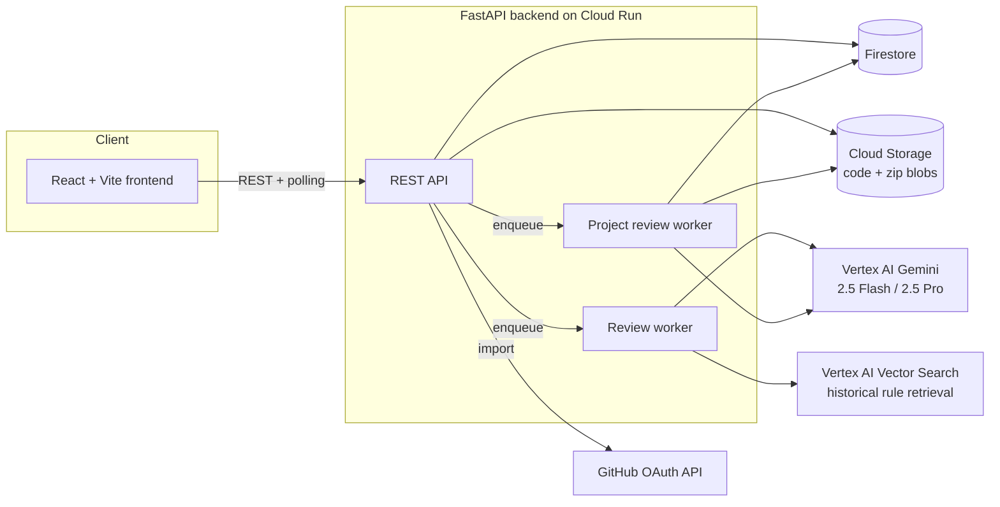

# 24/7 Intelligent Code Reviewer

An AI code review platform built on **Google Cloud + Gemini** that reviews a single file or an
entire project (zip upload or a GitHub repo) for security, correctness, and quality issues —
async, resumable, and cost-aware about which files get the expensive model.

Built for **AIM Code Kitchen Season 01, presented by Google Cloud**.

> See [PLAN.md](PLAN.md) for the full phased build log and [docs/](docs/) for feature-level design
> notes (project/zip review, GitHub import, retry & versioning).

## What it does

- **Code Review** — paste or upload a single file, get a Gemini-generated score, issues, and
  suggestions, informed by a retrieval step over previously-reviewed code with similar issues.
- **Project Review** — upload a `.zip` or import directly from GitHub (OAuth: browse your repos and
  branches, pick a commit, go). The backend extracts, profiles the project (language/framework
  detection), lets you pick which files to include, then reviews every selected file concurrently
  and synthesizes one project-level report: overall score, worst files, most common issue category,
  and prioritized recommendations.
- **Dashboard** — score trends over time, issue-category distribution, and per-project history for
  both single-file and project reviews.

## What makes the architecture worth a second look

- **Tiered Gemini routing, not a flat rate.** Every file in a project review is classified into a
  priority tier (auth/api/source/config/docs/tests/...) by `file_prioritizer.py`. Only
  security- or architecture-critical tiers (`auth`, `api`) and the final cross-file synthesis pass
  are sent to **Gemini 2.5 Pro**; everything else — the bulk of most codebases — goes to
  **Gemini 2.5 Flash**. Same review quality where it matters, a fraction of the latency and cost
  everywhere else.
- **Actually resumable, not just retryable.** Every project file has its own persisted status
  (`QUEUED → COMPLETED/FAILED/SKIPPED`) in Firestore, and the worker's dispatch loop only ever
  touches files still `QUEUED`. That one invariant is what makes retrying a handful of failed files,
  retrying an entire failed project, regenerating just the final summary, and even **recovering
  projects abandoned by a backend restart** all safe to implement as "reset the target files to
  `QUEUED` and re-publish the same project ID" — no separate recovery code path, no re-upload.
- **Cancellation that's actually responsive.** Cancelling isn't a status flag nobody checks — the
  worker re-checks for a pending cancellation before *and after* every retry backoff sleep, inside
  the semaphore-guarded per-file task, and again right before the final aggregation pass, so a
  cancel lands within one file's work, not after an entire in-flight retry schedule plays out.
- **Untrusted input, treated like it.** Submitted code is analyzed as text only — never executed,
  imported, or evaluated. Every zip upload is checked for zip-bombs (compression ratio, total
  uncompressed size, entry count) and path traversal before a single byte is extracted, and the
  prompt sent to Gemini is built to resist prompt-injection from the code being reviewed.
- **Bounded, budgeted, and honest about partial failure.** Per-file concurrency, token/line/size
  budgeting, and a `PARTIAL` project status (some files failed, real ones still get scored) mean a
  slow or noisy file never drags down or silently zeroes out the rest of the project's results.

## Architecture



Single-file reviews and project reviews run on **separate in-process async queues** so a large
project can never head-of-line-block a quick single-file review sitting behind it.

## Tech stack

| Layer | Stack |
|---|---|
| Frontend | React 19, TypeScript, Vite, TanStack Query, React Router, Monaco Editor |
| Backend | FastAPI, Pydantic, async Python |
| AI | Gemini 2.5 Flash / Pro via `google-genai` (Vertex AI), Vertex AI Vector Search for RAG |
| Data | Firestore (per-user reviews/projects), Cloud Storage (source + zip blobs) |
| Async | In-process queues standing in for Pub/Sub (see `docs/` for the real-Pub/Sub-shaped design) |
| Auth | GitHub OAuth (repo import), dev-stub bearer auth for the app itself |
| Infra | Docker, Google Cloud Run, deploy scripts in `infra/cloud-run/` |

## Repo layout

```
intelligent-code-reviewer/
├── frontend/           React + Vite + TS UI (dashboard, editor, progress, results, history)
├── backend/
│   └── app/
│       ├── api/        REST routes (reviews, projects, github, code_validation)
│       ├── services/   Gemini, Firestore, GCS, GitHub, zip extraction, project detection...
│       ├── workers/     Async queue consumers (single-file + project review)
│       ├── schemas/     Pydantic models
│       └── security/    Auth + input validation
├── docs/               Feature-level design notes (project review, GitHub import, retry model)
├── infra/cloud-run/    Cloud Run deploy scripts
├── scripts/            Historical data ingestion (Vector Search index build)
├── data/               Historical review rules seed data
└── PLAN.md             Full phased build log
```

## Running it locally

Requires Node 18+ and Python 3.10+.

### Quick start (no GCP account needed)

Everything below runs with `LOCAL_MODE=true` by default: an in-memory store instead of Firestore,
an in-process queue instead of Pub/Sub, and a rule-based mock analyzer instead of Gemini — enough
to explore the full product end to end with zero cloud setup.

**Backend**
```bash
cd backend
python3 -m venv .venv && source .venv/bin/activate
pip install -r requirements.txt
uvicorn app.main:app --reload --port 8000
```
Runs on http://localhost:8000. Health check: `GET /health`.

**Frontend**
```bash
cd frontend
npm install
npm run dev
```
Runs on http://localhost:5173. Sign in with any email (dev-only stub auth — see
`frontend/src/services/auth.tsx`).

**Tests**
```bash
cd backend
pip install -r requirements-dev.txt
pytest
```

**Docker Compose** (both services together)
```bash
docker compose up --build
```
Frontend on `:4173`, backend on `:8000`.

### Running against real Google Cloud

Set `LOCAL_MODE=false` and provide the variables below (via `backend/.env`, copy `.env.example` to
start). Requires a GCP project with Vertex AI, Firestore, and Cloud Storage enabled, plus a
service account key (`GOOGLE_APPLICATION_CREDENTIALS`).

| Variable | Purpose |
|---|---|
| `GOOGLE_CLOUD_PROJECT`, `GOOGLE_CLOUD_LOCATION` | GCP project/region |
| `GEMINI_MODEL` | Model for single-file Code Review |
| `PROJECT_REVIEW_FLASH_MODEL`, `PROJECT_REVIEW_PRO_MODEL` | Tiered models for Project Review (defaults: `gemini-2.5-flash` / `gemini-2.5-pro`) |
| `EMBEDDING_MODEL`, `VECTOR_SEARCH_INDEX`, `VECTOR_SEARCH_ENDPOINT` | Historical rule retrieval (RAG) |
| `PUBSUB_TOPIC`, `PUBSUB_SUBSCRIPTION` | Reserved for a real Pub/Sub-backed worker (currently in-process, see `docs/`) |
| `FIRESTORE_DATABASE`, `HISTORICAL_BUCKET` | Persistence + object storage |
| `GITHUB_CLIENT_ID`, `GITHUB_CLIENT_SECRET`, `GITHUB_OAUTH_REDIRECT_URI` | GitHub repo import (optional — the feature 503s cleanly if unset) |
| `PROJECT_REVIEW_CONCURRENCY` | Files analyzed concurrently per project (default 8, bounded by your Gemini quota) |

## Deployment

```bash
# Provision GCP resources once (Firestore, GCS bucket, Vector Search index, Pub/Sub topic)
./infra/setup-gcp-resources.sh

# Build + deploy the backend to Cloud Run
./infra/cloud-run/deploy-backend.sh

# Build + deploy the frontend
./infra/cloud-run/deploy-frontend.sh
```

Both scripts read their configuration from environment variables (the same ones listed above) and
are safe to re-run for a redeploy.

## Status

Actively developed. See [PLAN.md](PLAN.md) for the phase-by-phase build history, and `docs/` for
design notes on the project/zip review pipeline, GitHub import, and the retry/versioning model.
